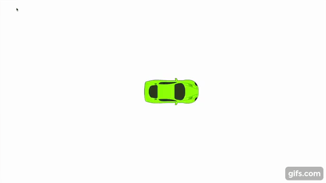

### Assignment 1: Driving a Car

#### Processing Code:
````
Mover m;
PVector force= new PVector(0, 0);
void setup() {
  fullScreen();
  m = new Mover();
  
}

void draw() {
  background(255);

  //// Apply the friction force vector to the object.
  //if (m.velocity.mag() > 0) {
  //  float c = 0.004; 
  //  PVector friction = m.velocity.get(); 
  //  friction.mult(-1); 
  //  friction.normalize(); 
  //  friction.mult(c); 
  //  m.applyForce(friction);
  //  println(friction.x);
  //  println(friction.y);
  //}

  m.update();
  m.checkEdges();
  m.display();
}

class Mover {

  PVector location;
  PVector velocity;
  PVector acceleration;
  float mass;

  PImage carTop;

  Mover() {
    location = new PVector(width/2, height/2);
    velocity = new PVector(0, 0);
    acceleration = new PVector(0, 0);
    mass = .1;
    
    carTop = loadImage("images/transparent/car_top.png");
  }
  void update() {
    velocity.add(acceleration);
    acceleration.mult(0); // this makes sure the acceleration is zer0 for the next fram
    location.add(velocity);
  }

  void display() {
    stroke(0);
    fill(175);
    //ellipse(location.x, location.y, 16, 16);

    imageMode(CENTER);
    pushMatrix();
    translate(location.x, location.y);
    rotate(velocity.heading());
    image(carTop, 0, 0);   
    popMatrix();
  }

  void applyForce(PVector force) {
    PVector f = force.get(); // Make a copy of the PVector before using it!
    f.div(mass);
    acceleration.add(f);
  }

  void checkEdges() {
    if (location.x > width) {
      location.x = 0;
    } else if (location.x < 0) {
      location.x = width;
    }

    if (location.y > height) {
      location.y = 0;
    } else if (location.y < 0) {
      location.y = height;
    }
  }
}

//represent each key with a vector
void keyPressed() {
  if (key == CODED) {
    if (keyCode == UP) {
      force.set(0, -0.01);
    } else if (keyCode == DOWN) {
      force.set(0, 0.01);
    } else if (keyCode == LEFT) {
      force.set(-0.01, 0);
    } else if (keyCode == RIGHT) {
      force.set(0.01, 0);
    }
    m.applyForce(force);
  }
}

````
##### Demo of my code:

[](https://www.youtube.com/watch?v=5idQny0czc4)

I am still working on adding friction to the applied forces. Currently, the only forces acting on the car are from the user using the arrow keys. 

#### UPDATED Processing Code: With friction

````

Mover m;
float initMag = 0.01; //value of force applied by the arrow key
PVector force= new PVector(0, 0);
void setup() {
  fullScreen();
  m = new Mover();
}

void draw() {
  background(255);

  //// Apply the friction force vector to the object.
  PVector friction = new PVector(0, 0); 
  if (m.velocity.mag() >= initMag) { //check if car moving in order to have friction
    float c = 0.0004; 
    friction = m.velocity.copy(); 
    friction.mult(-1); 
    friction.normalize(); 
    friction.mult(c); 
    m.applyForce(friction);
  } else {
    m.applyForce(friction); //if the car is not moving, don't apply friction
  }

  m.update();
  m.checkEdges();
  m.display();
}

class Mover {

  PVector location;
  PVector velocity;
  PVector acceleration;
  float mass;

  PImage carTop;

  Mover() {
    location = new PVector(width/2, height/2);
    velocity = new PVector(0, 0);
    acceleration = new PVector(0, 0);
    mass = .1;

    carTop = loadImage("images/transparent/car_top.png");
  }
  void update() {
    velocity.add(acceleration);
    acceleration.mult(0); // this makes sure the acceleration is zer0 for the next fram
    location.add(velocity);
  }

  void display() {
    stroke(0);
    fill(175);
    //ellipse(location.x, location.y, 16, 16);

    imageMode(CENTER);
    pushMatrix();
    translate(location.x, location.y);
    rotate(velocity.heading());
    image(carTop, 0, 0);   
    popMatrix();
  }

  void applyForce(PVector force) {
    PVector f = force.get(); // Make a copy of the PVector before using it!
    f.div(mass);
    acceleration.add(f);
  }

  void checkEdges() {
    if (location.x > width) {
      location.x = 0;
    } else if (location.x < 0) {
      location.x = width;
    }

    if (location.y > height) {
      location.y = 0;
    } else if (location.y < 0) {
      location.y = height;
    }
  }
}

//represent each key with a vector
void keyPressed() {
  if (key == CODED) {
    if (keyCode == UP) {
      force.set(0, -initMag);
    } else if (keyCode == DOWN) {
      force.set(0, initMag);
    } else if (keyCode == LEFT) {
      force.set(-initMag, 0);
    } else if (keyCode == RIGHT) {
      force.set(initMag, 0);
    }
    m.applyForce(force);
  }
}
````

##### Demo of my new code:

[](https://www.youtube.com/watch?v=6SW1KWJsN5o)
