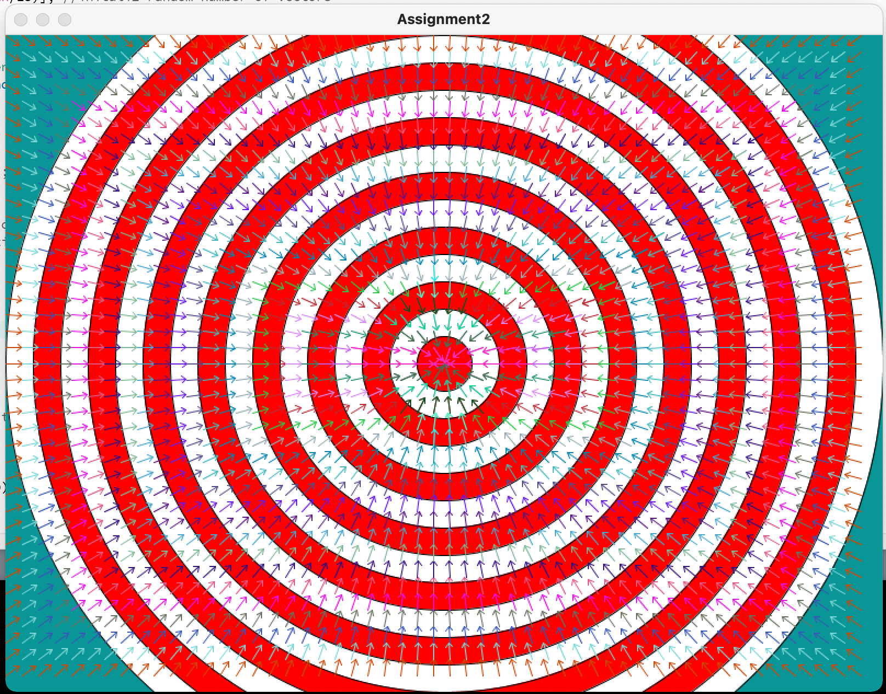
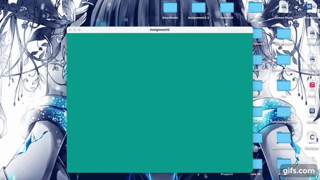

### Assignment 2 (February 15): "Playing" with Flow Fields

#### Some Products:
###### The flow field with the arrows pointing to the center:

###### The flow field of a PImage:

###### Using array lists to create animted flow field:

###### Creating vehicles in the flow field when the mouse is pressed:

###### Creating vehicles in the flow field that points to the center:

###### Creating vehicles in the flow field where the arrows point to the closest point:

#### Reflections:
###### Difficulties:
- Thinking in term of angles in order to get the arrows to point in the directions that I want
- Converting my concepts take a lot of time and headaches 
- Fall victim to my ambition

###### Interesting/Shocking Discoveriies:
- Quite fun playing with flow field although time consuming 
- I can not resize the canvas according to the size of my input image. In addition, size() does not take in variables as input
###### Questions:
- How to make a flow field that center a point gradually. The arrows should arrange in circle or spiral like shapes
- Still need to work on using angles to change directions of arrows 
