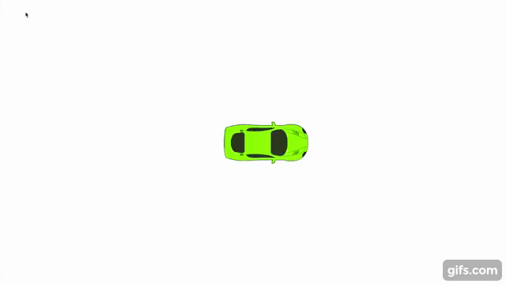
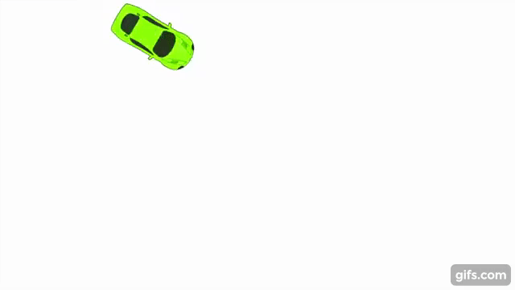
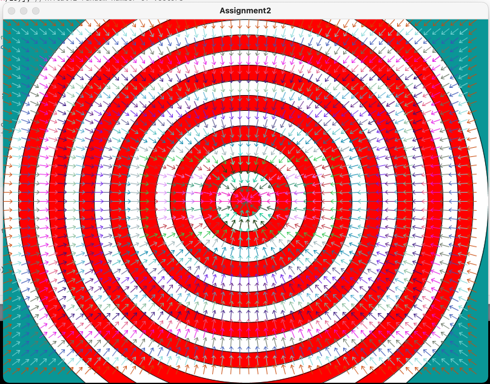
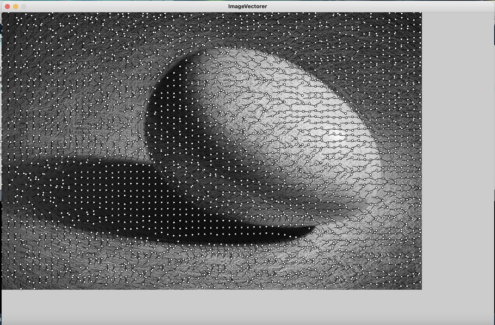
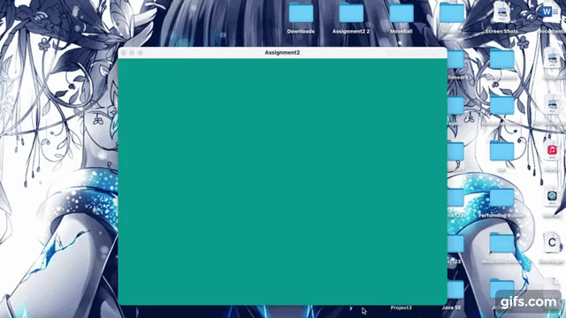
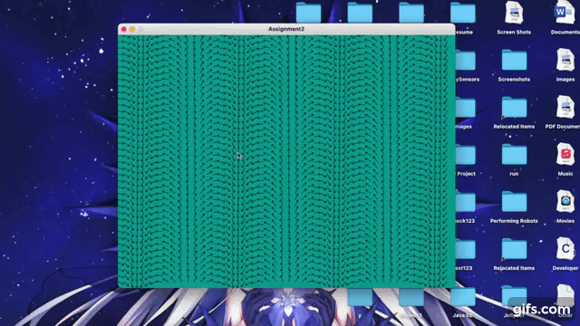
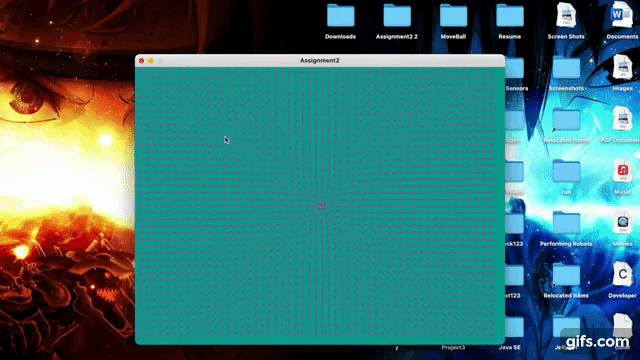
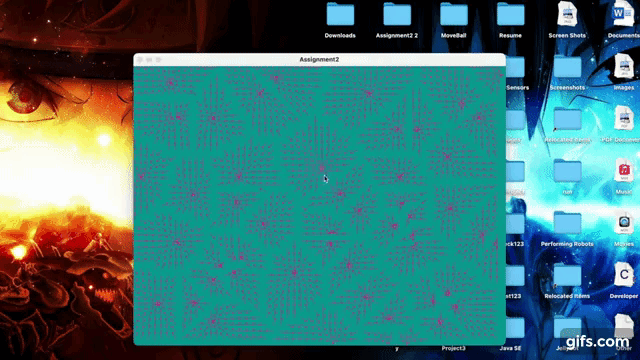

Shortcut to [current assignment](#Assignment-3-February-My-Project-Ideas)    
# RobotaPsyche

### Assignment 1: Driving a Car

#### Processing Code:
````
Mover m;
PVector force= new PVector(0, 0);
void setup() {
  fullScreen();
  m = new Mover();
  
}

void draw() {
  background(255);

  //// Apply the friction force vector to the object.
  //if (m.velocity.mag() > 0) {
  //  float c = 0.004; 
  //  PVector friction = m.velocity.get(); 
  //  friction.mult(-1); 
  //  friction.normalize(); 
  //  friction.mult(c); 
  //  m.applyForce(friction);
  //  println(friction.x);
  //  println(friction.y);
  //}

  m.update();
  m.checkEdges();
  m.display();
}

class Mover {

  PVector location;
  PVector velocity;
  PVector acceleration;
  float mass;

  PImage carTop;

  Mover() {
    location = new PVector(width/2, height/2);
    velocity = new PVector(0, 0);
    acceleration = new PVector(0, 0);
    mass = .1;
    
    carTop = loadImage("images/transparent/car_top.png");
  }
  void update() {
    velocity.add(acceleration);
    acceleration.mult(0); // this makes sure the acceleration is zer0 for the next fram
    location.add(velocity);
  }

  void display() {
    stroke(0);
    fill(175);
    //ellipse(location.x, location.y, 16, 16);

    imageMode(CENTER);
    pushMatrix();
    translate(location.x, location.y);
    rotate(velocity.heading());
    image(carTop, 0, 0);   
    popMatrix();
  }

  void applyForce(PVector force) {
    PVector f = force.get(); // Make a copy of the PVector before using it!
    f.div(mass);
    acceleration.add(f);
  }

  void checkEdges() {
    if (location.x > width) {
      location.x = 0;
    } else if (location.x < 0) {
      location.x = width;
    }

    if (location.y > height) {
      location.y = 0;
    } else if (location.y < 0) {
      location.y = height;
    }
  }
}

//represent each key with a vector
void keyPressed() {
  if (key == CODED) {
    if (keyCode == UP) {
      force.set(0, -0.01);
    } else if (keyCode == DOWN) {
      force.set(0, 0.01);
    } else if (keyCode == LEFT) {
      force.set(-0.01, 0);
    } else if (keyCode == RIGHT) {
      force.set(0.01, 0);
    }
    m.applyForce(force);
  }
}

````
##### Demo of my code:

[](https://www.youtube.com/watch?v=5idQny0czc4)

I am still working on adding friction to the applied forces. Currently, the only forces acting on the car are from the user using the arrow keys. 

#### UPDATED Processing Code: With friction

````

Mover m;
float initMag = 0.01; //value of force applied by the arrow key
PVector force= new PVector(0, 0);
void setup() {
  fullScreen();
  m = new Mover();
}

void draw() {
  background(255);

  //// Apply the friction force vector to the object.
  PVector friction = new PVector(0, 0); 
  if (m.velocity.mag() >= initMag) { //check if car moving in order to have friction
    float c = 0.0004; 
    friction = m.velocity.copy(); 
    friction.mult(-1); 
    friction.normalize(); 
    friction.mult(c); 
    m.applyForce(friction);
  } else {
    m.applyForce(friction); //if the car is not moving, don't apply friction
  }

  m.update();
  m.checkEdges();
  m.display();
}

class Mover {

  PVector location;
  PVector velocity;
  PVector acceleration;
  float mass;

  PImage carTop;

  Mover() {
    location = new PVector(width/2, height/2);
    velocity = new PVector(0, 0);
    acceleration = new PVector(0, 0);
    mass = .1;

    carTop = loadImage("images/transparent/car_top.png");
  }
  void update() {
    velocity.add(acceleration);
    acceleration.mult(0); // this makes sure the acceleration is zer0 for the next fram
    location.add(velocity);
  }

  void display() {
    stroke(0);
    fill(175);
    //ellipse(location.x, location.y, 16, 16);

    imageMode(CENTER);
    pushMatrix();
    translate(location.x, location.y);
    rotate(velocity.heading());
    image(carTop, 0, 0);   
    popMatrix();
  }

  void applyForce(PVector force) {
    PVector f = force.get(); // Make a copy of the PVector before using it!
    f.div(mass);
    acceleration.add(f);
  }

  void checkEdges() {
    if (location.x > width) {
      location.x = 0;
    } else if (location.x < 0) {
      location.x = width;
    }

    if (location.y > height) {
      location.y = 0;
    } else if (location.y < 0) {
      location.y = height;
    }
  }
}

//represent each key with a vector
void keyPressed() {
  if (key == CODED) {
    if (keyCode == UP) {
      force.set(0, -initMag);
    } else if (keyCode == DOWN) {
      force.set(0, initMag);
    } else if (keyCode == LEFT) {
      force.set(-initMag, 0);
    } else if (keyCode == RIGHT) {
      force.set(initMag, 0);
    }
    m.applyForce(force);
  }
}
````

##### Demo of my new code:

[](https://www.youtube.com/watch?v=6SW1KWJsN5o)

### Assignment 2 (February 15): "Playing" with Flow Fields

#### Some Products:
###### The flow field with the arrows pointing to the center:


###### The flow field of a PImage:


###### Using array lists to create animted flow field:
[](https://youtu.be/h-oIYOQHUYs)

###### Creating vehicles in the flow field when the mouse is pressed:
[](https://youtu.be/gRkRCqM0YEc)

###### Creating vehicles in the flow field that points to the center:
[](https://youtu.be/taa6phtvPCU)

###### Creating vehicles in the flow field where the arrows point to the closest point:
[](https://youtu.be/dUvdtBE9pd8)

#### Reflections:
###### Difficulties:
- Thinking in term of angles in order to get the arrows to point in the directions that I want
- Converting my concepts take a lot of time and headaches 
- Fall victim to my ambition

###### Interesting/Shocking Discoveriies:
- Quite fun playing with flow field although time consuming 
- I can not resize the canvas according to the size of my input image. In addition, size() does not take in variables as input
###### Questions:
- How to make a flow field that center a point gradually. The arrows should arrange in circle or spiral like shapes
- Still need to work on using angles to change directions of arrows 

### Assignment 3 (February 22): My Project Ideas
##### Boid DNA:
The main and most important variable in my DNA class is the survivablity variable. This variable is declared as a float and initiated with an initial value of 1, meaning that all the boids have the same chance of surviving. Then, as the process procedes, this parameter increaes or decreases depending on the interaction to show a certain boid's survivability. However, its value will never get greater than 1.

There are certain criteria that are put into consideration when determing the survivability of a boid. My DNA has other two vairables: color and size. Thus, depending on these two conditions, a boid's survivabilty may increase or decrease depending on how well its color and size let its adapt to its environment(flow field). For example, if its color matches with the flow field, it will have camaflouge and have a very high chance of surviving. On the other hand, if a boid size is really large but the flow field has narrow path, it won't be able to travel smoothly or keep up with the flock, so its survability will be really low.

### Assignment 3 (March 1): Bugs Simulation
#### My Final Product:
[](https://www.youtube.com/watch?v=SA2FcCZLtvE)
