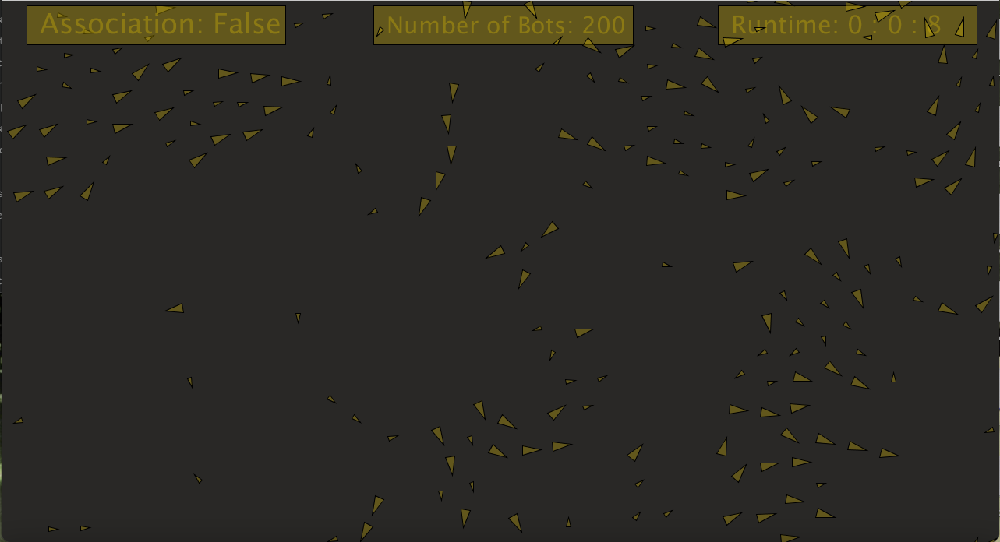

# Final Project: Simulating a Simple Ecosystem

### Project Concept
My project is about creating an evironment where, initially, animals  of different kinds are randomly put together to interact. Like a real world ecosystem, animals have these relations such as preys, predators, or allies (same species). However, these relations will be randomly assinged to them, so they need to figure this out through interactions. For instance, when animal A notices that another animal of its kind (same features like color, size, speed) gets eaten by animal B, animal A will learn to avoid animal B. Animal A learns that animal B is a predator. On the other hand, animal B will notice that any animals that have same features as the animal it had eaten are its preys. 

As the simulation continues, animals will learn to associate which animals are preys, predators, or allies based on their interaction. Then, preys will move away from predators, while predators chase after preys. In addition, animals of the same kind will move together as a group to protect themselves or hunt for food. At the end of the simulation, I expect to see these animals able to decide which animals they can form allies with and which animals they need to avoid. This will be shown in whether they are moving in group or avoiding each other. 


### Progress Journal
#### Log 0: 
I was looking for image sprites to put in my project. I saw some image sprites of spiders, squirrels, tigers, and other bugs. I downloaded them all. 
#### Log 1: 
I started thinking about how to code the "learning" process of each animal. I was playing around with Michael's Association program. I added a variable relation to the class Vehicle as a mean of keeping track of its relation to other animals. However, I soon realized that it was not right to define a relation to yourself; it should be relations to other animals. Thus, one variable will not be enough. I needed to create an arraylist the stores its relations to other animals. The array list will store all the animals that will be created in the main program. 

#### Log 2: 
I came across a problem as I started coding random relations for these animals. When one animal ate another animal, the eaten animal would be deleted, so it wouldn't be able to pass information to other animals. I needed to store this information somewhere outisde the animal class in order for animals to acess this information. I took a step to consider what I meant in my Project Concept when I said "animal A notices." So far, when I was running through the array list of animals, information only passed between two animals at a time during the loop. I needed to find a way to allow the information to pass out to other animlas, so they could "notice" what was going on between the two interacting animals. 

I tried to create loops within loops to allow other animals to be involved in the other animals' interactions. I felt like this is too complicated. I may need to simplify how I create their relationships. 

#### Log 3: 
I simplified their relations by creating a function that gave them relations based on their size. I created Animal class (similar to Michael's Vehicle class), where in the constructor I randomly two sizes to the animal. 
````
  if (round(random(1))== 1) {
      r = 3;
    } else {
      r = 6;
    }
````
Thus, their relations would mainly depend on their size: when two animals encounter each other, the one with larger size have a higher chance to be a predator. 
````
//randomly defines relations between animals
  int relation(Animal other) {
    float chance = random(100);

    if (other.r > r) {
      // if size is bigger, high chance of being a predator
      if (chance > 20) {
        return 1;     //relation is a predator
      }
    } else {
      // chance is lower to be a predator
      if (chance > 80) {
        return 1;
      }
    }

    return 2;  // netural relation ship
  }
````
The function relation returns either 1 or 2: 1 means another animal is a predator, while two means ally.

#### Log 4: 
I worked on when to give these animals relations. Like Michael, I only gave them relations when they are within certain distance from each other and not themselves. 

````
//function to define the relationship between various animals randomly depending on their sizes
  int defineRelations(ArrayList<Animal> animals) {
    //println("Me: " + serialNumber);
    int count = 0;
    for (Animal animal : animals) {
      // What is the distance between me and another Vehicle?
      float d = PVector.dist(location, animal.location);

      // If the distance is zero we are looking at ourselves so skip over ourselves
      if (d == 0) {
        continue;
      }

      // If the distance is greater than tooClose skip this vehicle
      if (d > tooClose) {
        continue;
      }

      //calls functiont that randomly defines the relationships
      if ( animal.serialNumber != this.serialNumber) {
        int[] codes = new int[3];
        int num= relation(animal);
        codes[0] = num;

        //println("code:" + num);
        //println("num" + num);
        int[] nCodes = new int[3];
        if (num == 1) {
          nCodes[0] =0;
          count++;


          //println("here");
        } else if (num == 0) {
          nCodes[0] =1;
        } else {
          nCodes[0] =2;
          nCodes[1] =40;
          codes[1] = 40;
        }
        this.dict.put(animal.serialNumber, codes);
        animal.dict.put(this.serialNumber, nCodes);
      }
    }
    //println("c " + count);
    return count;
  }

````
Down the line, I decided to use a dictionary to store information about their relations because I noticed that each animal has a unique serial number. Thus, each animal has a dictionary with other animals' serial numbers as the key value. For each animal, I can use other animals' serial numbers to look up the relations easier. 

Notice that the dictionary stores an integer array of 3 values. The first value of the array defines the relations between animals. The second value of the array defines the distance they should stay between each other. The third value I had not thought of yet. 

#### Log 5:
I used the values from the dictionary to code the behaviors between the animals. I ran through the loop of animals, check their relations, and use the distance value to implement how far they should stay from each other, whether they should align, codhere, or separate. It took some time to test for the values I should use for their distance. 
````
if (dict.get(other.serialNumber) != null &&  dict.get(other.serialNumber)[0] == other.dict.get(serialNumber)[0] && (d > 10) && (d < neighbordist)) {

        //println(serialNumber + " : " + dict.get(other.serialNumber)[0]);
        desiredseparation = dict.get(other.serialNumber)[1];        
        sum.add(other.velocity);        
        count++;
      }
````
The code above shows how I checked their relationship. I made sure that dictionary stores some information regarding that key first. Second, I decided if the values of their relation are the same, meaning they are friends. If true, I retrieved the distance value from the array, so I can set their distance closer together. On the other hand, if they are not friends, the distance between will remain far part, representing the preys' desire to stay away. 

#### Log 6:
Now I started thinking about how to implement the association feature. I came up with a simpler version in which the assocation has to do with large animals. I created a threshold to set how many larger animals can be predators. If the number of larger animals who are preadtors surpass this threshold, than smaller animals will consider them as predators.

````
int numberOfAnimals = 200;  //number of bots/animals in the environemnt
int average = 0;           //keep track of the average number of predators who are large
boolean associate = false;  //associate is false at first
final float THRESHOLD =  numberOfAnimals * 0.8;  //threshold is 72% of total animals; 
````
I decided the threshold to be 80% of the total number of animals after many testing. Noticed that I have the variable average to keep track of the average number of larger animals who are predators from all the rounds during the simulation. When the threshold is passed, the boolean association becomes true and the association happens. 

#### Log 7:
I added some practical features to inform the viewers whether the association happened yet. It also showed the total number of animals in the simulation and the run time. 


It took me quite some time to get the displays of the boxes and the texts right because I made their sizes dynamic, meaning that their sizes are the ratios of the window size. Changing the sizes of the processing window will not cause the problem of the texts become bigger than the text boxes or put the boxes and the texts in awkward position or sizes. 

````
 //size of the box is the percentage of width and height
  boxWidth = width * 0.26;
  boxHeight = boxWidth * 0.15;

  //initiate the start location of box where state of association is shown
  asBoxStartX = width * 0.025;
  asBoxStartY = height * 0.01;

  //initiate the start location of box where number of bots is shown
  botBoxStartX = width * 0.373;
  botBoxStartY = height * 0.01;

  //initiate the start location of box where state of runtime is shown
  countBoxStartX = width * 0.718;
  countBoxStartY = height * 0.01;

  //offset is percentage of height and width of box
  textOffSetX = boxWidth * 0.05;
  textOffSetY = boxHeight * 0.7;
````


### Project Product
It turns out my project simulation is far simpler than what I planned. The final product is a simulation of two animals with two sizes. The ones with the larger size have higher chance to a predator while the smaller ones have higher chance to be a prey. Preys are coded to avoid predators. As the simulation is running, if the number of larger animals who are also predators surpasses the threshold, preys with associate larger animals as predators. At the end of the simulation, we will see that preys move with preys while predators move with predators. 

### Demo Videos

Simulation # 1 with 100 animals:

[](https://www.youtube.com/watch?v=NswwYQcuVkE&t)

Simulation # 2 with 150 animals:

[](https://www.youtube.com/watch?v=uDsjksdJaDU)

Simulation # 3 with 200 animals:

[](https://www.youtube.com/watch?v=OK1kmvzanII)

#### About the Simulation
Notice that it took different time for the association to happen in each of the demo above. The first demo with 100 animals took the longest time (6 minutes) to reach association stage while the one with 200 animals took only 18 seconds. The rationale is with more animals, more interactions happened because the space of the environment remained constant through out the three simulations. As the result of more interactions, more relations were formed and it became more likely to have higher number of predators who are large. 

I ran so many simulation with different thresholds and sizes of animals. Some thresholds did not work and needed adjustment. Sometimes, the association did not happen until 10 mintues or never happened at all. Everything is so random and anything could happen. 

You will see that I commented out many parts of my code because those parts were my tests and they did not work out. For example, I created a function to randomly intiate animals without having them overlap each other's location. However, it took such a long time to run time because the program needed to do so many loops to make sure that no overlaps occured. 

### Reflections
- Trial and error was the main process that I used to experiment with my codes. I had concepts in my head, but when I started to put them into codes, I found that they did not work out. To resolve this, I needed to find and test other ways that could make parts of my concept worked. I used my previous codes frequently to myself. 
- Since testing was such an important of this project, I found myself fascinated by what my code could do. Every time I added or removed something from my code, I was so eager to run the program and see the result. Most of the time the code did not do what I intended, but there was always that special time when my code produced wonders. For example, I ran this final project so many times and and for a long time. I was intrigued at how these bots behaved over time, especially when they started grouping together. I should be expecting this since I am coder, but still, I didn't know what to expect most of the time even though I am the creator. This made me think about the discussion that I had about robots through out this semester. Robot creaters might not know what they are creating then they put metal, chips, and codes together. We don't always know what we are doing or making. 
- I wish I could build a much more intricate ecosystem. It would be so awesome if my code went according to my project concept. I will continue working on this project, and aim to create much more complicated and natural relations between these animals. Although the whole progress was time consuming and involved a lot of problem fixings, I had fun and enjoy observing this fascinating simulation.


