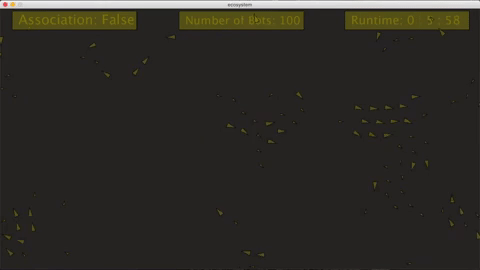

# Final Project: Simulating a Simple Ecosystem

### Project Concept
My project is about creating an evironment where, initially, animals  of different kinds are randomly put together to interact. Like a real world ecosystem, animals have these relations such as preys, predators, or allies (same species). However, these relations will be randomly assinged to them, so they need to figure this out through interactions. For instance, when animal A notices that another animal of its kind (same features like color, size, speed) gets eaten by animal B, animal A will learn to avoid animal B. Animal A learns that animal B is a predator. On the other hand, animal B will notice that any animals that have same features as the animal it had eaten are its preys. 

As the simulation continues, animals will learn to associate which animals are preys, predators, or allies based on their interaction. Then, preys will move away from predators, while predators chase after preys. In addition, animals of the same kind will move together as a group to protect themselves or hunt for food. At the end of the simulation, I expect to see these animals able to decide which animals they can form allies with and which animals they need to avoid. This will be shown in whether they are moving in group or avoiding each other. 

### Progress Journal
#### Log O: 
I was looking for image sprites to put in my project. I saw some image sprites of spiders, squirrels, tigers, and other bugs. I downloaded them all. 
#### Log 1: 
I started thinking about how to code the "learning" process of each animal. I was playing around with Michael's Association program. I added a variable relation to the class Vehicle as a mean of keeping track of its relation to other animals. However, I soon realized that it was not right to define a relation to yourself; it should be relations to other animals. Thus, one variable will not be enough. I needed to create an arraylist the stores its relations to other animals. The array list will store all the animals that will be created in the main program. 

#### Log 2: 
I started coding random relations between 

### Demo Videos

Simulation # 1 with 100 animals:

Simulation # 2 with 150 animals:

Simulation # 1 with 200 animals:

